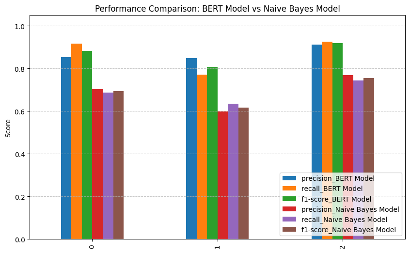

# Sentiment Analysis with DistilBERT and Naive Bayes


[](https://huggingface.co/Adam0x75/distilbert-finetuned-sentiment-analysis) 

A comprehensive project comparing a classic Naive Bayes model with a fine-tuned DistilBERT transformer for sentiment analysis on a 3-class dataset (Negative, Neutral, Positive). The superior DistilBERT model is deployed as an interactive web application using Gradio.

---

## 🚀 Live Demo

You can try the deployed DistilBERT model live! The application is hosted on Gradio.
**[➡️ Click here to access the Live Demo](https://huggingface.co/spaces/Adam0x75/sentiment-analysis)**

---

## 📋 Table of Contents
- [Project Overview](#-project-overview)
- [Key Features](#-key-features)
- [Model Performance Comparison](#-model-performance-comparison)
- [Tech Stack](#-tech-stack)
- [Installation & Setup](#-installation--setup)
- [Project Structure](#-project-structure)
- [Future Improvements](#-future-improvements)

---

## 📖 Project Overview

This project aims to solve a 3-class sentiment analysis task. The workflow involves extensive data preprocessing, training two distinct models, and performing a detailed performance comparison.

1.  **Classic Approach:** A Multinomial Naive Bayes model was trained on stemmed and vectorized text data.
2.  **Transformer Approach:** A pre-trained DistilBERT model was fine-tuned on the same dataset for superior contextual understanding.

The results clearly show that the fine-tuned DistilBERT model significantly outperforms the Naive Bayes baseline across all metrics, demonstrating the power of transfer learning in NLP. The final model is hosted on the Hugging Face Hub and deployed in an easy-to-use web interface.

---

## ✨ Key Features

- **Data Preprocessing:** Handled imbalanced data using undersampling techniques.
- **Classic ML:** Built a complete pipeline for Naive Bayes including text cleaning (stemming, stopword removal) and `CountVectorizer`.
- **Deep Learning:** Fine-tuned a DistilBERT model using the Hugging Face `Trainer` API for efficient training and checkpointing.
- **Comprehensive Evaluation:** Compared the models using Precision, Recall, and F1-Score for each class.
- **Interactive Deployment:** Created a user-friendly web UI with Gradio.
- **Model Hosting:** Published the final, trained model to the Hugging Face Hub for easy access and reproducibility.

---

## 📊 Model Performance Comparison

The fine-tuned DistilBERT model consistently outperformed the Naive Bayes model, particularly in understanding the nuances between the classes.

 

**Key Takeaways:**
- **BERT's Superiority:** The DistilBERT model achieved an overall accuracy of **87.1%**, compared to **68.8%** for Naive Bayes.
- **F1-Scores:** BERT shows a much more balanced performance across all classes, as indicated by its higher F1-scores.

---

## 🛠️ Tech Stack

- **Programming Language:** Python
- **Machine Learning Libraries:** Scikit-learn, Imbalanced-learn
- **Deep Learning Framework:** PyTorch
- **NLP Library:** Hugging Face (Transformers, Datasets, Evaluate)
- **Deployment:** Gradio, Hugging Face Hub
- **Data Manipulation:** Pandas, NumPy
- **Text Processing:** NLTK

---

## ⚙️ Installation & Setup

To run this project locally, follow these steps.

**1. Clone the repository:**
```bash
git clone https://github.com/Adam556678/Python-Sentiment-Analysis.git
cd Python-Sentiment-Analysis
```

**2. Create and activate a virtual environment (recommended):**
```bash
# For Windows
python -m venv venv
venv\Scripts\activate

# For macOS/Linux
python3 -m venv venv
source venv/bin/activate
```

**3. Install the required dependencies:**
```bash
pip install -r requirements.txt
```

**4. Run the Gradio application:**
```bash
python app.py
```
The application will be available at `http://127.0.0.1:7860`.

---

## 📁 Project Structure

```
.
├── app.py                  # The Gradio deployment script
├── sentiment_analysis.ipynb # Jupyter Notebook with the full analysis and training process
├── requirements.txt        # Python dependencies for deployment
├── README.md               # You are here!
└── images/
    └── comparison_chart.png  # Folder for storing images
```

- **`app.py`**: A Python script to launch the Gradio web interface. It loads the fine-tuned model directly from the Hugging Face Hub.
- **`sentiment_analysis.ipynb`**: Contains all the steps from data loading and cleaning, to training and evaluating both the Naive Bayes and DistilBERT models.
- **`requirements.txt`**: A list of all necessary Python packages to run the application.

---

## 🚀 Future Improvements

- **Experiment with other transformer models** like RoBERTa or ALBERT.
- **Implement parameter-efficient fine-tuning (PEFT)** techniques like LoRA to reduce training costs.
- **Deploy to a permanent hosting solution** like Hugging Face Spaces for a 24/7 available demo.
- **Expand the dataset** or fine-tune on a more domain-specific corpus.
